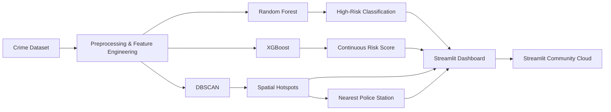

# 🚨 CrimeGuard AI
### AI-Powered Crime Risk Intelligence & Spatial Hotspot Detection

[](https://www.python.org/)
[](https://streamlit.io/)
[](https://scikit-learn.org/)
[](https://xgboost.readthedocs.io/)

> **CrimeGuard AI** combines supervised learning for crime-risk prediction with unsupervised spatial clustering for crime-hotspot discovery, exposed through an interactive Streamlit dashboard.

🌐 **Live Demo:** https://crimeguard-ai-gssl7q2rgoydszewi4ih72.streamlit.app/

---

## 1. Overview

CrimeGuard AI is a machine-learning capstone project built around a Boston crime dataset. The system addresses two complementary questions:

1. **Risk prediction:** given a district and time context, is the aggregated crime activity likely to be high risk?
2. **Hotspot discovery:** where are crimes spatially concentrated, independent of predefined district boundaries?

The final application brings the analytics together in one web dashboard with an interactive hotspot map and police-station context.

---

## 2. Problem Statement

Crime data is spatial and temporal. A useful intelligence tool should not only summarize historical incidents, but also surface **when** risk is elevated and **where** crime is concentrated.

CrimeGuard AI therefore combines:

- **Random Forest** for binary high-risk classification.
- **XGBoost** for continuous risk-score regression.
- **DBSCAN** for unsupervised spatial hotspot detection.
- **Streamlit** for interactive analysis and deployment.

---

## 3. Key Features

| Component | ML Task | What it Answers |
|---|---|---|
| 🌲 **Random Forest** | Supervised — **Classification** | *"Is this district/time combination high-risk right now?"* Outputs a binary `HIGH_RISK` label with a live probability score. |
| ⚡ **XGBoost** | Supervised — **Regression** | *"What is the continuous risk intensity at this location and time?"* Outputs a continuous risk score rather than a class. |
| 🗺️ **DBSCAN** | Unsupervised — **Spatial Clustering** | *"Where are crimes geographically concentrated?"* Discovers irregularly-shaped hotspots directly from coordinates, without relying on predefined district boundaries. |
| 🚓 **Proximity Engine** | Post-processing | Enriches every hotspot with its nearest police station and the distance to it, turning raw clusters into actionable intelligence. |
| 📊 **Streamlit Dashboard** | Deployment | Unifies all three models behind a single interactive, publicly-deployed web application. |

**Why three separate models instead of one?** Each model answers a distinct question that a single algorithm cannot answer alone: Random Forest gives a fast, interpretable **yes/no risk verdict**; XGBoost estimates **how intense** that risk is as a continuous surface; DBSCAN ignores administrative boundaries entirely and finds **where** crime physically clusters on the map. Together they form a layered intelligence system rather than a single black-box score.

---

## 4. Data & Preprocessing

The project uses a Boston crime dataset with geographic, temporal, and categorical crime attributes. The pipeline includes exploratory analysis and data preparation before modeling.

Key preprocessing steps include:

- Loading the crime CSV with the appropriate encoding.
- Inspecting missing values and distributions.
- Filling missing latitude/longitude values used during preprocessing.
- **Imputing missing `District` labels using K-Nearest-Neighbors (KNN) geographic imputation** — records with a missing district are matched against known district records using their nearest neighbors in Lat/Long space, and the majority district among those neighbors is assigned.
- Encoding categorical variables for supervised models.
- Aggregating crime activity by district, hour, day, and month for risk classification.
- Building a continuous spatial-temporal risk target for regression.

### Supervised Target Construction

The high-risk label is built by aggregating crime counts across **District × Hour × Day × Month** and applying a percentile-based cutoff:

- `HIGH_RISK = 1` when the aggregated crime count is at or above the **85th percentile**.
- `HIGH_RISK = 0` otherwise.

> **Note:** The exact preprocessing sequence lives in the project notebook and should remain the source of truth for reproducibility.

---

## 5. Machine Learning Models

### 🌲 Random Forest — High-Risk Classification

The Random Forest model works on district/time aggregates.

**Features**

- District
- Hour
- Day
- Month

**Model selection** uses GridSearchCV with 3-fold cross-validation and F1 scoring.

**Best parameters from the notebook**

```text
n_estimators      = 200
max_depth         = 20
min_samples_split = 5
```

**Test-set results from the notebook**

| Metric | Class 1 (High Risk) |
|---|---:|
| Precision | 0.76 |
| Recall | 0.67 |
| F1-score | 0.71 |

Overall test accuracy: **0.92**.

---

### ⚡ XGBoost — Continuous Risk Regression

XGBoost is trained as a regression model on spatial-temporal risk values.

**Features**

- Latitude
- Longitude
- Month
- Hour

**Notebook configuration**

```text
n_estimators      = 300
max_depth         = 6
learning_rate     = 0.05
subsample         = 0.8
colsample_bytree  = 0.8
```

**Test-set results from the notebook**

- RMSE: **0.917**
- R²: **0.203**

> **Deployment note:** the current Streamlit risk probability displayed to the user is calculated from `RandomForestClassifier.predict_proba()`. The XGBoost model is preserved as a separate model artifact; it is **not fused with Random Forest into an ensemble probability** in the current dashboard.

---

### 🗺️ DBSCAN — Spatial Crime Hotspots

DBSCAN is used as an **unsupervised** clustering method on geographic coordinates rather than relying only on predefined district boundaries.

**Features**

- Latitude
- Longitude

**Notebook configuration**

```text
MIN_SAMPLES = 25
EPS_KM      = 0.08
metric      = haversine
```

The project uses the Larceny subset for the documented hotspot analysis and computes, for each hotspot:

- Hotspot name / ID
- Crime count
- Center latitude / longitude
- Radius
- Nearest police station
- Distance to the nearest police station

**Notebook result:** **146 hotspots** were discovered, with **11,300 scattered/noise reports** out of **25,842** analyzed reports.

---

## 6. Spatial Intelligence Engine — Hotspot + Police Station Proximity

Each hotspot is enriched with police-station context so the dashboard can answer not only:

> "Where is the hotspot?"

but also:

> "Which police station is nearest, and how far away is it?"

For every hotspot discovered by DBSCAN, the pipeline computes the geographic center, then searches the police-station reference set for the nearest station and calculates the distance to it in kilometers. This converts a raw geographic cluster into an actionable record the dashboard can rank and prioritize.

The final hotspot table contains:

```text
hotspot_name
hotspot_id
crime_count
center_lat
center_long
radius_km
nearest_station
dist_to_station_km
```

---

## 7. System Architecture



---

## 8. Streamlit Dashboard

The deployed dashboard provides:

### 🔍 Risk Analysis

- District selection
- Day selection
- Month selection
- Hour selection
- Random Forest risk classification
- Risk probability display

### 🗺️ Hotspot Intelligence

- DBSCAN hotspot count
- Interactive Folium map
- Clickable hotspot details
- Crime counts
- Hotspot radius
- Nearest police station
- Distance to nearest station
- Top hotspot table

---

## 9. Project Structure

```text
CrimeGuard-AI/
│
├── app.py
├── README.md
├── requirements.txt
├── .gitignore
│
└── models/
    ├── random_forest.pkl
    ├── xgboost.pkl
    └── dbscan_hotspots.pkl
```

The deployment repository intentionally keeps the runtime application and serialized model artifacts separate from the research notebooks and raw datasets.

---

## 10. Run Locally

### 1. Clone the repository

```bash
git clone https://github.com/Ibrahemahmedezzat/CrimeGuard-AI.git
cd CrimeGuard-AI
```

### 2. Install dependencies

```bash
pip install -r requirements.txt
```

### 3. Run the app

```bash
streamlit run app.py
```

Then open the local URL shown by Streamlit.

---

## 11. Deployment

The production dashboard is deployed with **Streamlit Community Cloud** from the GitHub repository.

**Live:** https://crimeguard-ai-gssl7q2rgoydszewi4ih72.streamlit.app/

Deployment flow:

```text
Local app.py
   ↓
git push
   ↓
GitHub repository
   ↓
Streamlit Community Cloud
   ↓
Public web application
```

---

## 12. Limitations

- Crime-risk predictions are learned from historical data and should not be interpreted as certainty about future incidents.
- The current dashboard probability is based on Random Forest only; XGBoost is not fused into an ensemble score.
- DBSCAN hotspot results depend on the selected crime subset and the chosen `eps` / `min_samples` settings.
- Historical reporting patterns can contain geographic and temporal bias.

---

## 13. Future Work

- Add an interactive crime-type selector for DBSCAN.
- Allow live tuning of `eps` and `min_samples` with guardrails.
- Add time-aware hotspot evolution.
- Add richer model-comparison views.
- Package preprocessing and models into a single reproducible pipeline.
- Add monitoring, model versioning, and automated retraining.

---

## 14. Capstone Deliverables

- ✅ GitHub repository
- ✅ Streamlit web application
- ✅ Serialized trained models
- ✅ Interactive hotspot visualization
- ✅ Project README / documentation
- ✅ Public deployment

---

## 15. Team

CrimeGuard AI was built by a five-person capstone team, with work organized across data analysis, supervised modeling, unsupervised hotspot detection, application integration, and deployment/documentation:

- **إبراهيم (Ibrahim)**
- **فرح (Farah)**
- **حبيبة (Habiba)**
- **أمنية (Omnia)**
- **شروق (Shorouk)**

> **Academic project disclaimer:** CrimeGuard AI is a capstone/educational system. It should not be used as the sole basis for operational policing, personal safety decisions, or resource allocation.
